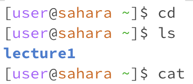
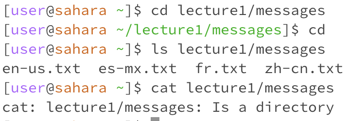
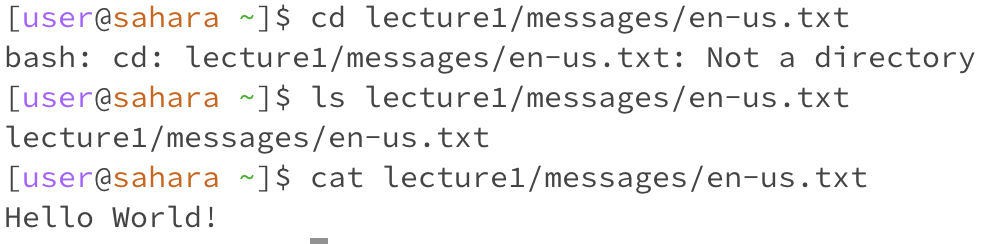

For all of these commands, I am in the home directory, indicated by a `~` in the terminal. For the `cd` command, seemingly nothing happened when I simply ran `cd`. This is because running `cd` by itself with no additional arguments changes your working directory to the home directory. Since I was already in the home directory, `cd` changed my directory to itself, and did seemingly nothing. The `ls` command listed all of the directories and files underneath the home directory. Since there is only one directory underneath the home directory, lecture 1, it returned `Lecture1`. Finally, `cat` returned nothing because it expected arguments. `cat` concatenates the contents of the arguments it is passed, and since I didn't give it any files or any text to concatenate, it simply returned nothing.

I am once again in the home directory for all of these commands. When I used the `cd` command, I gave the terminal the path to the `messages` directory. As this is a valid directory, the terminal changed my working directory to the `messages` directory. When I used the `ls` command, I passed the home directory the path to the `messages` directory. As such, the terminal listed all of the files and directories in the `messages` directory. These included all of the `.txt` files underneath the `messages` directory, including the one I added during the lab. For the `cat` command, I passed it the path to the `messages` directory as an argument. This returned an issue, because `cat` expects two arguments to concatenate, or combine. Since there was no text to concatenate, it returned.

For my final set of commands, I am once again in the home directory. When I used the `cd` command, I gave the terminal the path to one of the text files in the `messages` directory. This threw the error `Not a directory`. This is simply because `cd` or "change directory" expects to be passed the name of a directory. It changes what workspace you're in, what files you have access to, etc. When it is passed a file, it doesn't know what to do with the path. A file isn't a workspace or some directory with different files and folders within it- it's just a file. As such, this command throws an error. the `ls` command, when called on the same file, did not throw an error and simply printed the name of the file I passed to the terminal. This is likely because "listing" the files in a file is just printing the name of the file. There's only one file in a file. Finally, the `cat` command called on a file printed the message contained in the file. This is because even though you aren't combining two files, calling `cat` on one file is the same as adding 0, or nothing, to it. As such, it just prints the contents of the first argument.
