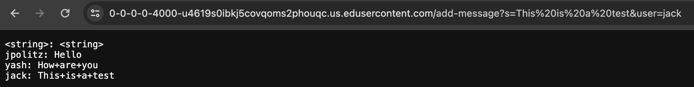
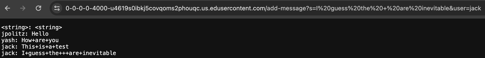
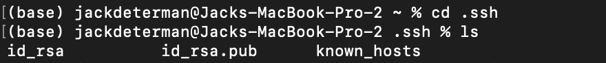
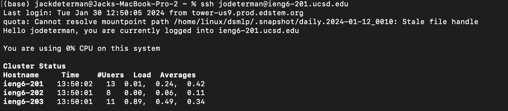

_PART 1_

The method in my code that gets called is `handleRequest(URI url)`. This is the main method of the `ChatServer.java` file, which parses the server's URL and outputs the correct messages onto the webpage. The only argument this method takes, and thus the only relevant argument, is the URL of the server being run. This is important because the values of different variables within the class change depending on the url of the server.

For example, in this screenshot, the path of the URL passed to the method contained `add-message?s=This%20is%20a%20test&user=jack`. When my method parsed this, it first changed the `url` variable to match the argument. From there, it extracted the query (Separated by the `?`), and split the query into `"s="`, `"This%20is%20a%20test"`, `"user="`, and "`jack`". From there, the method added the correct message to the chat history by modifying the `chat`, `user`, and `message` variables. While `user` and `message` are changed each time an argument is passed to the method, `chat` is permanently changed to satisfy the requirement that the webpage displays the full chat history after each new URL. As a side note, it is important to recognize that my input to the URL, the URL itself, and the chat display different characters for `" "`. This is not an intentional substitute in my method, but a difference in how spaces are displayed by a URL and parsed by my computer.

This is another example of a slightly more complicated argument passed to the method. In truth, I was experimenting with adding an intentional `"+"` to my URL to see if there would be any surprises in how it was parsed and outputted, but there were not. 

Just like in the previous example, the method in my code that gets called is `handleRequest(URI url)`. The only relevant argument is the URL of the server being run.

Once again, my method followed the same steps as above to parse the query and extract `user` and `message` from it before permanently adding to  `chat`.

 
 
 

_PART 2_

This is a screenshot of the path to my public and private ssh keys. Of course, I did not screenshot the actual keys, but if I run the command `cat rsa_id.pub` or `cat rsa_id`, I can see and directly access my public and private ssh keys.

This is a screenshot of a terminal interaction where I log into my `ieng6` account without using my password.

 
 
 

_PART 3_

I completely forgot some of the nuances of remote connection when I was doing this lab, and ended up asking for help about it on EdStem. To be honest, I still have some experimenting to do to figure out some of the stuff that was going on, but I did realize that I was not supposed to be running this lab remotely, which made things go much more smoothly once I adjusted to them. I definitely learned about remote connections the past few weeks.
