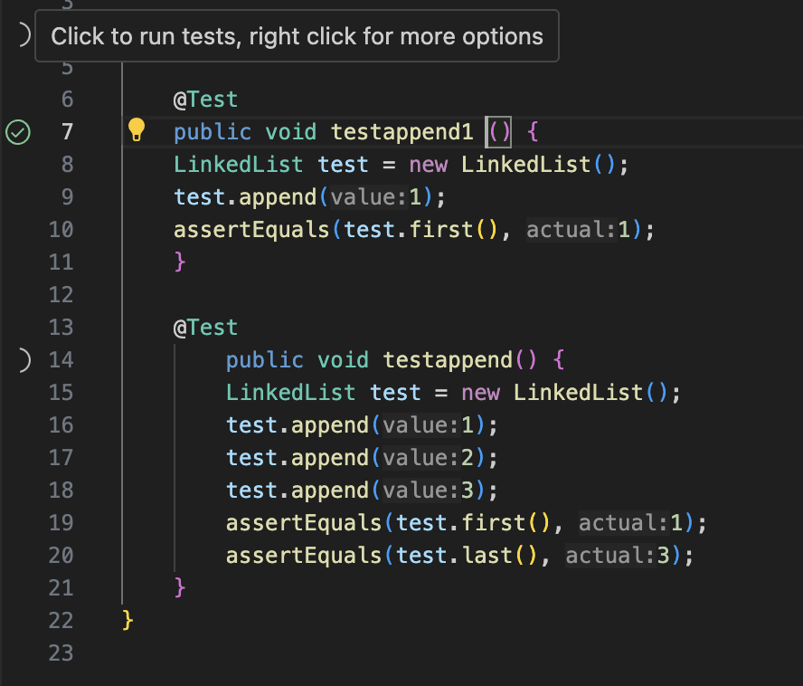
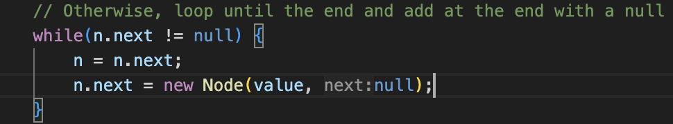
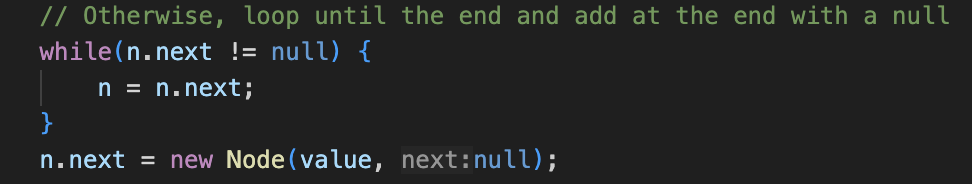

_Part 1_

The bug I am choosing from Week 4's lab is the bug present in the `append` method in the `LinkedList` class. 

<br>
<br>
<br>

Here is a failure-inducing input for the buggy method:

```
@Test 
	public void testappend() {
    LinkedList test = new LinkedList();
    test.append(1);
    test.append(2);
    test.append(3);
    assertEquals(test.first(), 1);
    assertEquals(test.last(), 3);
	}
```
<br>

The associated code that causes this to fail is the following:
```
while(n.next != null) {
            n = n.next;
            n.next = new Node(value, null);
        }
```

<br>


An input that doesn't induce a failure is

```
@Test 
	public void testappend() {
    LinkedList test = new LinkedList();
    test.append(1);
    assertEquals(test.first(), 1);
	}
```

<br>

The code associated with this test's passing is 

```
Node n = this.root;
        if(n.next == null) {
            n.next = new Node(value, null);
            return;
        }
```
<br>
<br>

The symptoms associated with running the tests are shown below:



<br>
<br>

And the bug, as before and after code blocks, is also shown below:




<br>

The issue in the starter code is in the logic of the `while`-loop. Each time through the `while`-loop, `n.next` would be assigned to a new `Node` containing the `value` the user wanted to append to the list. As such, `n.next == null` was never satisfied, as `n.next` would be assigned to a new `Node` every time the `while`-loop was executed. This meant that the loop would run forever if the program reached it. By moving the assignment of the new `Node` to the outside of the `while`-loop, we prevent an infinite amount of new `Node` assignments. Now, only _after_ reaching the end of the list and satisfying `n.next == null`, we create a new `Node` with the desired `value` and append it to the list.


<br>
<br>
<br>

_PART 2_


