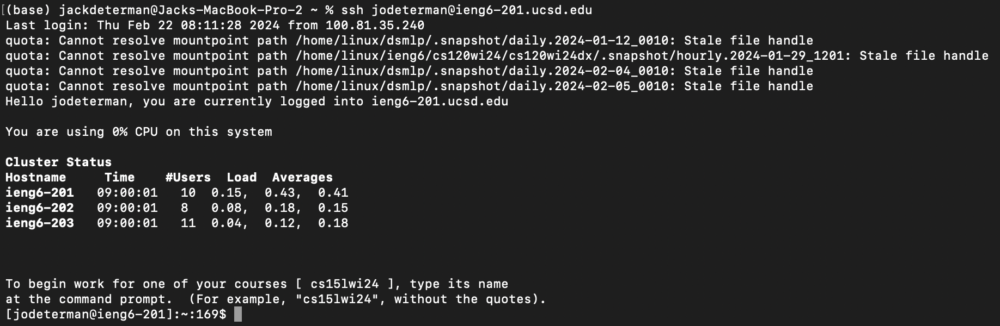
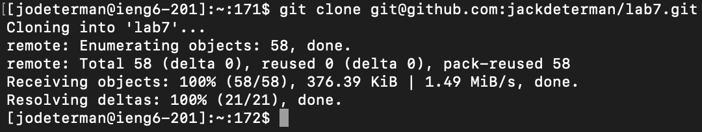
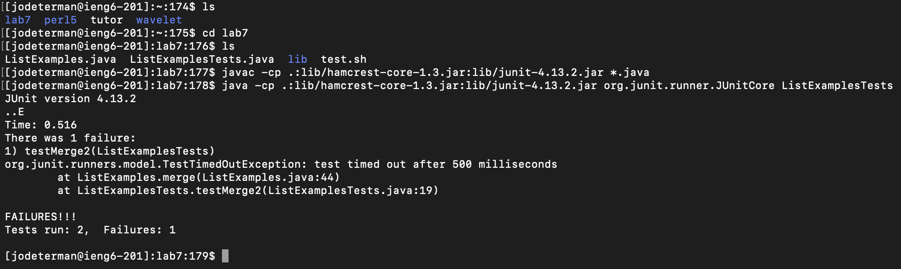
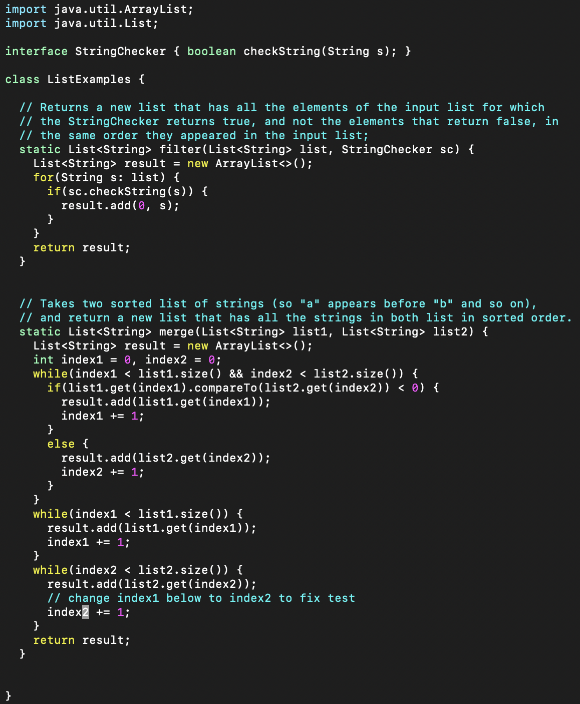
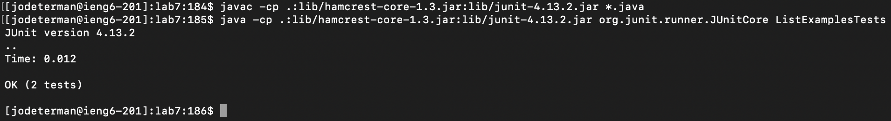
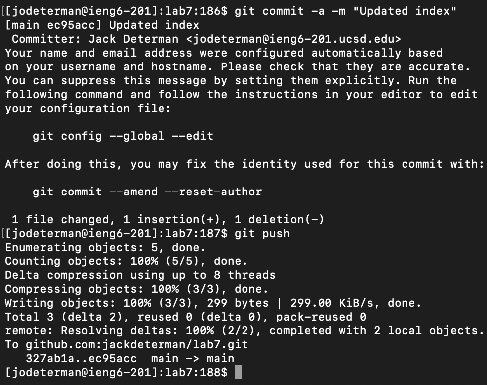

# Lab Report 4

### Step 4. Logging onto ieng6:

 
 

 

For this step, I typed `ssh jodeterman@ieng6-201.ucsd.edu` into my terminal. This isn't really using any shortcuts, because I had  
started a new terminal to complete this lab report. I did not have this connection in my command history.

### Step 5. Cloning my fork of the repository:

 
 

 

For this step, I typed `git clone` and then `Ctrl + V` into my terminal. I had copied the GitHub address from my repository, and so  
I did not need to type out  `git@github.com` blah blah blah. 
 
 

### Step 6. Running failed tests:

 
 

 

For this step, I simply typed `cd lab7` followed by `Ctrl + V` and then `Enter` into the terminal, because I had already copied  
the correct test-running command from the lab report write-up.  As such, all I had to manually type was the `cd` command to switch  
to the correct repository. I could've also typed `la` + `Tab` or something like that, but it wouldn't have saved much time.
 
 

### Step 7. Edit the code file:

 
 

 

For this step, I typed `vim ListEx` + `Tab`, which autofilled the correct file. Then, I just typed `.java`, before pressing `Enter`  
To open the `ListExamples.java` file in `vim` editor. My cursor was already in the correct location to edit the `index1` variable,  
so it was easy for me to fix the code: I pressed `x` (To delete the end of `index1`), followed by `i` (To tell `vim` I want to insert  
text), followed by `2` (To replace the `1` with a `2` in the previously incorrect `index1` variable name). This correctly edited  
the file, and all I had left was to save my changes and exit the file. I did this by pressing `esc` to return to Normal Mode in vim, 
and then typing `:wq!` into the file to save my changes and exit the file.

 
 

### Step 8. Run the successful tests:

 
 

 

For this step, I simply needed to repeat the commands to compile and run the `.java` files in the `lab7` repository. To do this, I  
pressed `up` `up` twice, because I had only run two commands since first compiling the `.java` files. As such, `up` `up` returned this  
command to my command line, and I pressed  `Enter` to compile the files. Then, I pressed `up` `up` again, bringing back the command to  
run the test file. I reran the tests, and they all passed.

 
 

### Step 4. Commit and Push:

 
 

 

For this step, I manually typed `git commit -a -m` and then my commit message followed by `Enter`, and then `git push `  and `Enter`  
to commit and push my changes to the origin. I had not typed these commands previously, so I do not think there were any shortcuts  
I was supposed to use to complete this step.
