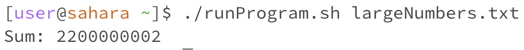

# Part 1:


#### Strange Sum Calculation in Java Program

Hello, I've been working on a Java program for our assignment that calculates the sum of numbers read from a file. 
It works fine for small numbers, but when I tested it with a larger set of numbers, the sum was wildly incorrect. 
I even got a negative number once! I thought Java automatically handled large sums, so I'm a bit lost. 
Here's a part of the output I got:

<br>


<br>

I double-checked the numbers in my file, and they definitely don't add up to anything near that. Does anyone know what might be going wrong?

<br>
<br>

### TA Response
Hi there! It sounds like you might be encountering an integer overflow issue. 
Java int types have a maximum value, and if your sum exceeds that, it will wrap around to negative numbers and behave unexpectedly. 
Can you check the data type you're using for your sum? As a quick test, try using a long instead of an int for the sum variable 
and see if that fixes your issue. This could help identify if the overflow is the culprit.

<br>
<br>

Body:
Thanks for the tip! I changed my sum variable from int to long, and it fixed the issue. 
The sum is now correct, even for the large set of numbers. Here's the corrected output:

<br>



<br>

I didn't realize how easily int could overflow, and using long solved it.
I've learned something new about data types and their limits. Thank you!


## Setup and Resolution Details
<br>
#### File & Directory Structure:
<br>

`MyProgram.java` - The Java program.
`runProgram.sh` - The Bash script to compile and run MyProgram.java.
`largeNumbers.txt` - The input file containing a large set of numbers that cause int overflow.
<br>
<br>
Contents of Each File Before Fixing the Bug:

<br>

#### `MyProgram.java`:

```
import java.io.File;
import java.io.FileNotFoundException;
import java.util.Scanner;

public class MyProgram {
    public static void main(String[] args) {
        if (args.length != 1) {
            System.out.println("Usage: java MyProgram <filename>");
            return;
        }

        String filename = args[0];
        try {
            File file = new File(filename);
            Scanner scanner = new Scanner(file);
            int sum = 0;
            while (scanner.hasNextInt()) {
                sum += scanner.nextInt();
            }
            scanner.close();

            System.out.println("Sum: " + sum); // Potential for incorrect result due to overflow
        } catch (FileNotFoundException e) {
            System.out.println("File not found: " + filename);
        }
    }
}

```

#### `runProgram.sh`

```
#!/bin/bash

javac MyProgram.java

java MyProgram "$1"
```

#### `largeNumbers.txt`

```
1000000001
1200000001
2300000001
2400000001
```
<br>

#### Full command line to trigger the buggy output:

`./runProgram.sh largeNumbers.txt`

#### Description of What to Edit to Fix the Bug:
In MyProgram.java, change the data type of the sum variable from int to long to handle larger sums without overflowing.


# Part 2:

I learned about vim in the second half of this quarter. While I was already comfortable with a lot of the programming in this class,
I had never used vim before. It was fun to get used to editing files with the keyboard shortcuts in that way, although
it was very frustrating at first. I can see how it's a superpower when you become good at it, so I'm going to try to work in vim
more to get used to different methods of changing cells.
