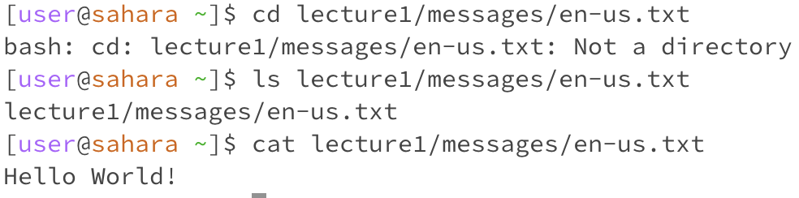

For all of these commands, I am in the home directory, indicated by a "~" in the terminal. For the cd command, seemingly nothing happened when I simply ran "cd." This is because running "cd" by itself with no additional arguments changes your working directory to the home directory. Since I was already in the home directory, "cd" changed my directory to itself, and did seemingly nothing. The ls command listed all of the directories and files underneath the home directory. Since there is only one directory underneath the home directory, lecture 1, it returned "Lecture1." Finally, cat returned nothing because it expected arguments. Cat concatenates the contents of the arguments it is passed, and since I didn't give it any files or any text to concatenate, it simply returned nothing.

